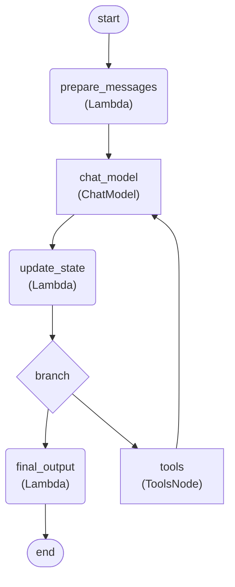

```mermaid
graph TD
  chat_model["chat_model<br/>(ChatModel)"]
  end_node([end])
  final_output("final_output<br/>(Lambda)")
  prepare_messages("prepare_messages<br/>(Lambda)")
  start_node([start])
  tools["tools<br/>(ToolsNode)"]
  update_state("update_state<br/>(Lambda)")
  chat_model --> update_state
  final_output --> end_node
  prepare_messages --> chat_model
  start_node --> prepare_messages
  tools --> chat_model
  update_state_branch_0{"branch"}
  update_state --> update_state_branch_0
  update_state_branch_0 --> final_output
  update_state_branch_0 --> tools

```