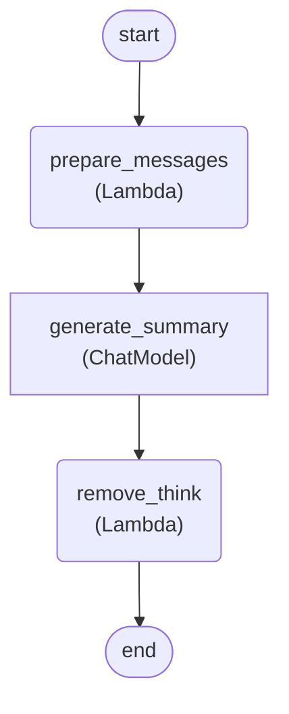

```mermaid
graph TD
  end_node([end])
  generate_summary["generate_summary<br/>(ChatModel)"]
  prepare_messages("prepare_messages<br/>(Lambda)")
  remove_think("remove_think<br/>(Lambda)")
  start_node([start])
  generate_summary --> remove_think
  prepare_messages --> generate_summary
  remove_think --> end_node
  start_node --> prepare_messages

```