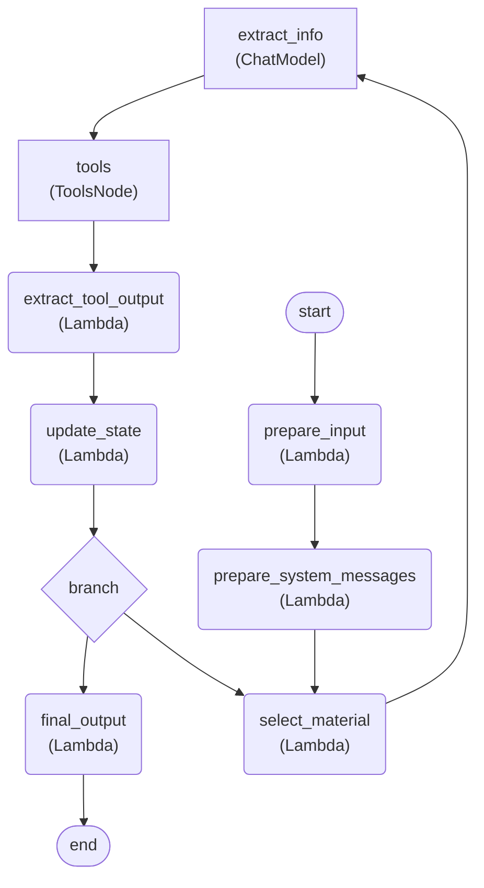

```mermaid
graph TD
  end_node([end])
  extract_info["extract_info<br/>(ChatModel)"]
  extract_tool_output("extract_tool_output<br/>(Lambda)")
  final_output("final_output<br/>(Lambda)")
  prepare_input("prepare_input<br/>(Lambda)")
  prepare_system_messages("prepare_system_messages<br/>(Lambda)")
  select_material("select_material<br/>(Lambda)")
  start_node([start])
  tools["tools<br/>(ToolsNode)"]
  update_state("update_state<br/>(Lambda)")
  extract_info --> tools
  extract_tool_output --> update_state
  final_output --> end_node
  prepare_input --> prepare_system_messages
  prepare_system_messages --> select_material
  select_material --> extract_info
  start_node --> prepare_input
  tools --> extract_tool_output
  update_state_branch_0{"branch"}
  update_state --> update_state_branch_0
  update_state_branch_0 --> final_output
  update_state_branch_0 --> select_material

```