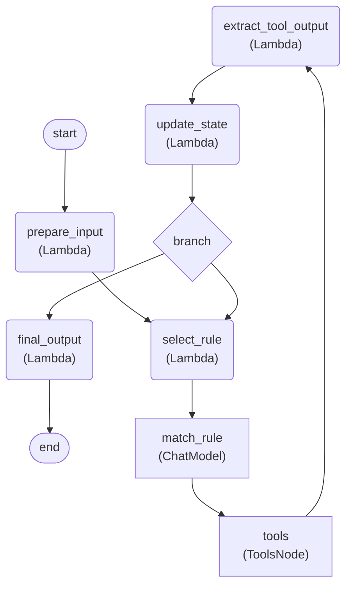

```mermaid
graph TD
  end_node([end])
  extract_tool_output("extract_tool_output<br/>(Lambda)")
  final_output("final_output<br/>(Lambda)")
  match_rule["match_rule<br/>(ChatModel)"]
  prepare_input("prepare_input<br/>(Lambda)")
  select_rule("select_rule<br/>(Lambda)")
  start_node([start])
  tools["tools<br/>(ToolsNode)"]
  update_state("update_state<br/>(Lambda)")
  extract_tool_output --> update_state
  final_output --> end_node
  match_rule --> tools
  prepare_input --> select_rule
  select_rule --> match_rule
  start_node --> prepare_input
  tools --> extract_tool_output
  update_state_branch_0{"branch"}
  update_state --> update_state_branch_0
  update_state_branch_0 --> final_output
  update_state_branch_0 --> select_rule

```